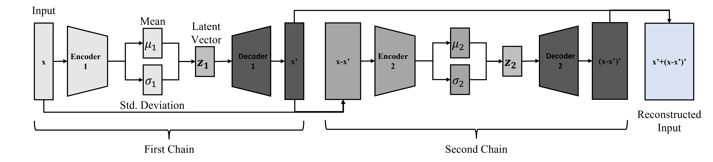
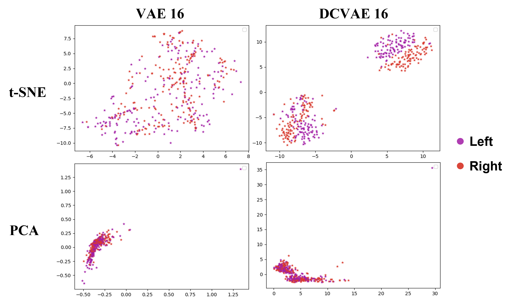
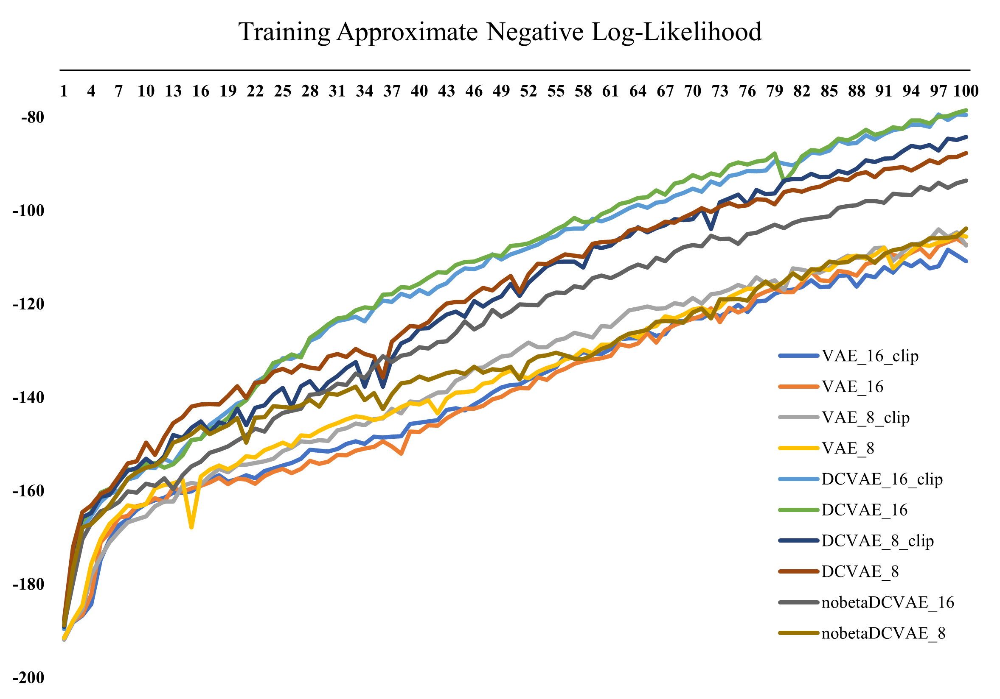
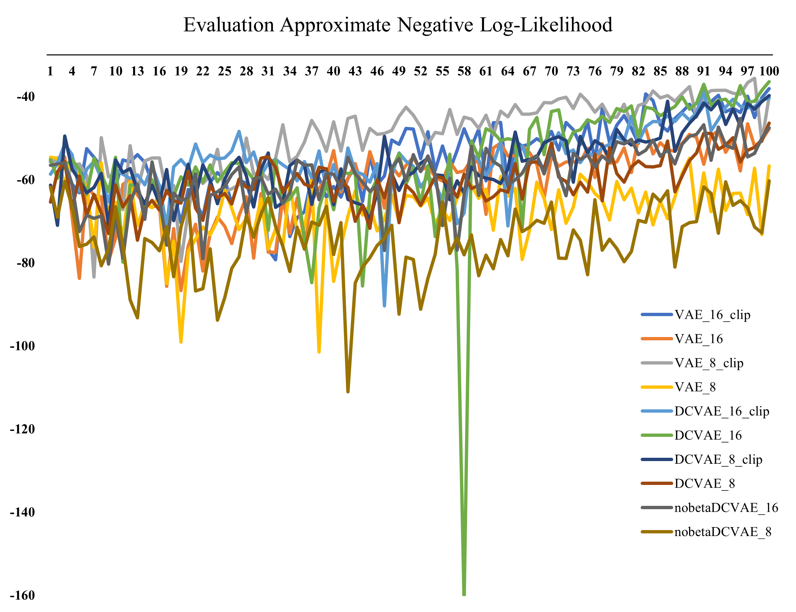
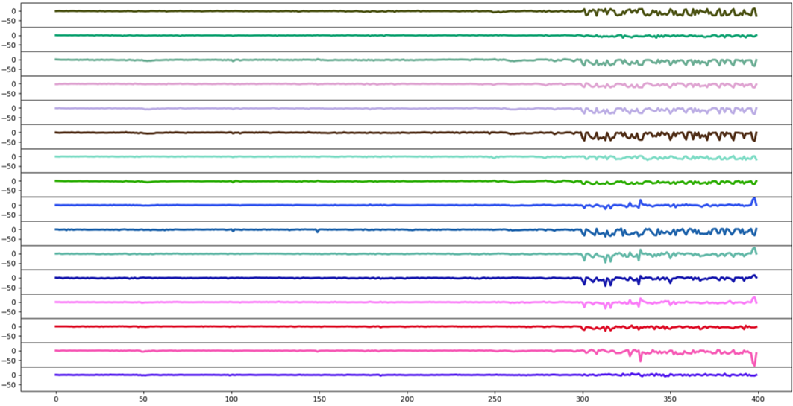
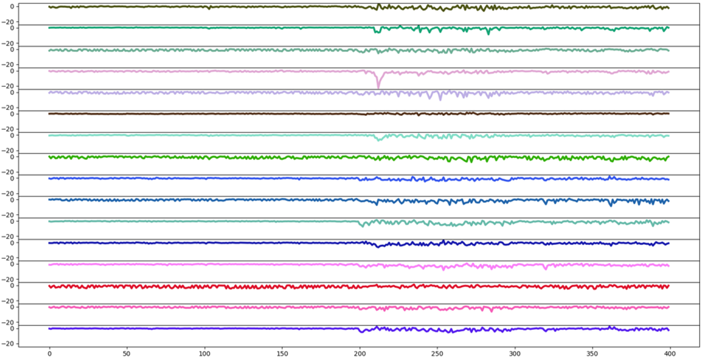

# DualChainVAE
Codes for DualChainVAE Pytorch Implementation for extraction of spatiotemporal features. A pytorch implementation of a vanilla VAE counterpart is included. The dataset used for spatiotemporal feature extraction is an EEG Dataset from Korea University consisting of 54 subjects consisting of Left vs Right Motor Imagery. The sEMG dataset includes 4-channel surface EMG data from 40 participants. The gestures in the data are rest or neutral state, extension of the wrist, flexion of the wrist, ulnar deviation of the wrist, radial deviation of the wrist, grip, abduction of all fingers, adduction of all fingers, supination, and pronation. In this study we focus on the flexion extension portion of the data.

## Model Overview

Overview of the Dual Chain Variational Autoencoder model architecture.

Optimisation function for the Dual Chain Variational Autoencoder:


## Summary of Results
The results display the test approximated negative log-likelihood scores of the various model and their settings. For the sEMG data, an additional Linear Discriminant Analysis (LDA) score is added in brackets ().

| Methodology |VAE|VAE+Clip|DCVAE|beta-DCVAE|beta-DCVAE + Clip|
|-|-|-|-|-|-|
| 16 (EEG) |  | |  |  |  |
| 8 (EEG) |  | |  |  |  |
| 16 (sEMG) |  | |  |  |  |
| 8 (sEMG) |  | |  |  |  |

### PCA/t-SNE Plots
Qualitative Analysis of VAE and DCVAE with 16 features, trained on 100 epochs.



### Training/Evaluation Overview
Training Curve of the various model permutations for a single subject (subject 6):



Evaluation Curve of the various model permutations for a single subject (subject 6):



### Features Overview
Features of a subject with poor signal consistency between training phases and test phase (subject 30):



Features of a subject with good signal consistency between sessions (subject 35):




### Reconstruction
To be updated.

## Resources
Raw Dataset: [EEG](http://gigadb.org/dataset/100542)

Raw Dataset: [sEMG](https://data.mendeley.com/datasets/ckwc76xr2z/2)

## Instructions
### Install the dependencies
It is recommended to create a virtual environment with python version 3.7 and activate it before running the following:

```
pip install -r requirements.txt
```

### Obtain the raw dataset
Download the raw dataset(s) from the resources above, and save them to the same `$source` folder. To conserve space, you may only download files that ends with `EEG_MI.mat` for the EEG dataset. 

For the sEMG dataset, you may download the files belonging to the `filtered` folder.

### Pre-process raw dataset
#### EEG Dataset
The following command will read the raw dataset from the `$source` folder, and output the pre-processed data `KU_mi_smt.h5` into the `$target` folder.

```
python preprocess_h5_smt.py $source $target
```
#### sEMG Dataset
The following command will read the raw dataset from the `$source` folder, and output the pre-processed data `semg_flexex_smt.h5` into the `$target` folder.

```
python preprocess_semg.py $source $target
```


## Training and Evaluation

### Traditional VAE
The traditional VAE can be found implemented in `vae_torch.py`.
```
usage: python vae_torch.py [-subj SUBJ] [-epochs EPOCHS] [-features FEATURES] [-lr LR] [-clip CLIP] [-data DATA]

Arguments:
-subj SUBJ(REQUIRED)    Set the subject number to run feature extraction on
-epochs EPOCHS          Set the number of epochs for which to train the VAE
-features FEATURES      Set the desired number of features to extract from the signal
-lr LR                  Set the learning rate
-clip CLIP              Set maximum gradient threshold
-data DATA              Set which data to analyse, eeg or semg

```

For example the following command trains a vanilla VAE on subject 1 for 16 latent features, for 100 epochs, no gradient clipping with a learning rate of 0.0005 on EEG data for subject 1.
```
python vae_torch.py -subj 1     
```

Final results may be found in the following files:
```
vae_output_LDA_train.txt    Reports the Linear Discriminant Analysis Score for all extracted features according to the true class
vae_output_LDA_test.txt     Reports the Linear Discriminant Analysis Score for the test extracted features on a trained LDA model
vae_output_NLL.txt          Reports the test negative log-likeilhood approximated by the total loss
vae_output_recon.txt        Reports the test reconstruction loss by the final trained model

vae_torch.pt                Final saved model weights using best validation loss
```

### DualChainVAE
The DualChainVAE can be found implemented in `dual_vae_torch.py`.
```
usage: python dual_vae_torch.py [-subj SUBJ] [-epochs EPOCHS] [-features FEATURES] [-lr LR] [-clip CLIP] [-alpha ALPHA] [-beta BETA] [-loss LOSS] [-data DATA]

Arguments:
-subj SUBJ(REQUIRED)    Set the subject number to run feature extraction on
-epochs EPOCHS          Set the number of epochs for which to train the VAE
-features FEATURES      Set the desired number of features to extract from the signal
-lr LR                  Set the learning rate
-clip CLIP              Set maximum gradient threshold
-alpha ALPHA            Set the alpha hyperparameter for KL Divergence in the first chain
-beta BETA              Set the beta hyperparameter for KL Divergence in the second chain
-loss LOSS              Uses one of three possible loss functions to train the DCVAE model. 
                        Default - Default DCVAE loss. Full - Uses entire reconstruction loss. Indiv - Sum of individual chain losses.
-data DATA              Set which data to analyse, eeg or semg

```

For example the following command trains a Dual Chain VAE on subject 1 for 16 total latent features split to 8-8, for 100 epochs, no gradient clipping with a learning rate of 0.0005 on EEG data for subject 1.
```
python dual_vae_torch.py -subj 1     
```

Final results may be found in the following files:
```
dual_output_LDA_train.txt    Reports the Linear Discriminant Analysis Score for the extracted features according to the true class
dual_output_LDA_test.txt     Reports the Linear Discriminant Analysis Score for the test extracted features on a trained LDA model
dual_output_NLL.txt          Reports the test negative log-likeilhood approximated by the total loss
dual_output_recon.txt        Reports the test reconstruction loss by the final trained model

dual_vae_torch.pt            Final saved model weights using best validation loss
```
