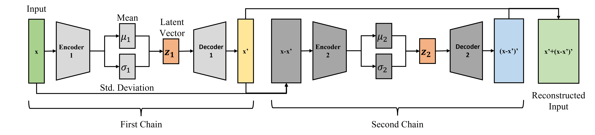
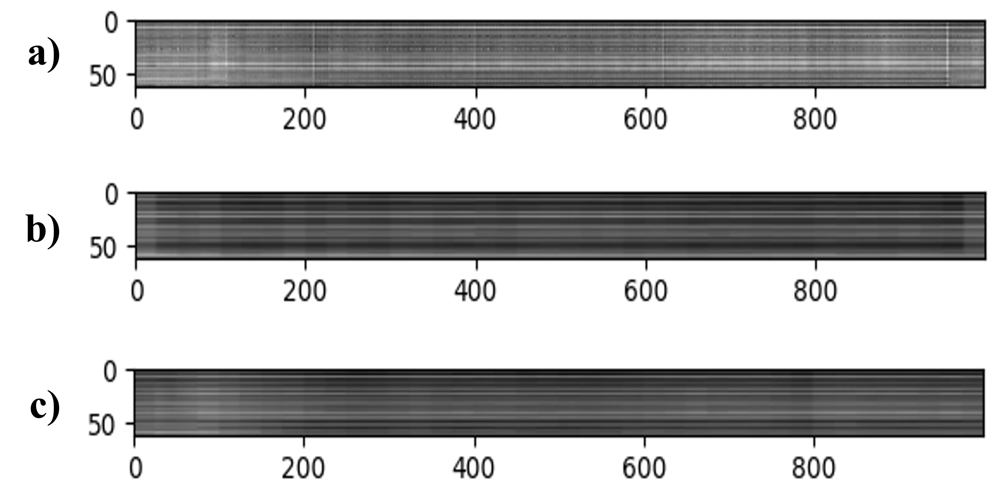

# Deep Unsupervised Representation Learning for Feature-Informed EEG Domain Extraction

## DualChainVAE
Codes for DualChainVAE Pytorch Implementation for extraction of spatiotemporal features. A pytorch implementation of a vanilla VAE counterpart is included. The dataset used for spatiotemporal feature extraction is an EEG Dataset from Korea University consisting of 54 subjects consisting of Left vs Right Motor Imagery. The sEMG dataset includes 4-channel surface EMG data from 40 participants. The gestures in the data are rest or neutral state, extension of the wrist, flexion of the wrist, ulnar deviation of the wrist, radial deviation of the wrist, grip, abduction of all fingers, adduction of all fingers, supination, and pronation. In this study we focus on the flexion extension portion of the data.

## Model Overview

Overview of the Dual Chain Variational Autoencoder model architecture.

Optimisation function for the Dual Chain Variational Autoencoder:


## Summary of Results
The results display the test approximated negative log-likelihood scores of the various model and their settings.

| Methodology |VAE|VAE+Clip|DCVAE|beta-DCVAE|beta-DCVAE + Clip|
|-|-|-|-|-|-|
| 8 (EEG) | -87.2 |-90.1 |-100.8  |-78.6  |-135.2  |
| 16 (EEG) |-91.2  |-89.0 |-82.5  |**-74.8**  |-84.0  |
| 8 (sEMG) | -7.50E-3 |-6.88E-4 |-3.38E-3  |-2.03E-3  |**-3.07E-4**  |
| 16 (sEMG) |-1.17E-2  | -8.59E-4 |-5.87E-3  |-4.21E-3  |-4.55E-4  |


The table below shows comparison between the use of different loss functions. Default uses the proposed optimisation function based on only the second chain reconstruction loss. Full uses the conventional reconstruction loss between the input and output of the entire network. Indiv uses the sum of individual reconstruction losses of both chains. The baseline model used is a beta-DCVAE for 16 features, with alpha and beta hyperparameters are set to 0.25 as suggested in the paper. No gradient clipping is used for EEG while a clipping threshold of 0.25 is used for sEMG.

| Methodology |Default|Full|Indiv|
|-|-|-|-|
| 16 (EEG) | **-74.8** |-84.2 |-101.9  |
| 2 + Clip (sEMG) | **-2.52E-4** |**-2.52E-4** |**-2.52E-4**  |

### PCA/t-SNE Plots
Qualitative Analysis of VAE and DCVAE with 16 features, trained on 100 epochs.


### Training/Evaluation Overview
Training Curve of the various model permutations for a single subject (subject 6):


Evaluation Curve of the various model permutations for a single subject (subject 6):


### Features Overview
Features of a subject with poor signal consistency between training phases and test phase (subject 30):


Features of a subject with good signal consistency between sessions (subject 35):


### Reconstruction
Reconstruction of EEG dataset.



a) Original input data. b) Conditional reconstruction. c) Sampled from the prior distribution.

## Resources
Raw Dataset: [EEG](http://gigadb.org/dataset/100542)

Raw Dataset: [sEMG](https://data.mendeley.com/datasets/ckwc76xr2z/2)

## Instructions
### Install the dependencies
It is recommended to create a virtual environment with python version 3.7 and activate it before running the following:

```
pip install -r requirements.txt
```

To install pytoch for a conda environment use the following command:
```
conda install pytorch torchvision torchaudio cudatoolkit=11.3 -c pytorch
```
For a pip environment:
```
pip3 install torch torchvision torchaudio --extra-index-url https://download.pytorch.org/whl/cu113
```

### Obtain the raw dataset
Download the raw dataset(s) from the resources above, and save them to the same `$source` folder. To conserve space, you may only download files that ends with `EEG_MI.mat` for the EEG dataset. 

For the sEMG dataset, you may download the files belonging to the `filtered` folder.

### Pre-process raw dataset
#### EEG Dataset
The following command will read the raw dataset from the `$source` folder, and output the pre-processed data `KU_mi_smt.h5` into the `$target` folder.

```
python preprocess_h5_smt.py $source $target
```
#### sEMG Dataset
The following command will read the raw dataset from the `$source` folder, and output the pre-processed data `semg_flexex_smt.h5` into the `$target` folder.

```
python preprocess_semg.py $source $target
```


## Training and Evaluation

### Traditional VAE
The traditional VAE can be found implemented in `vae_torch.py`.
```
usage: python vae_torch.py [-subj SUBJ] [-epochs EPOCHS] [-features FEATURES] [-lr LR] [-clip CLIP] [-data DATA] [-datapath DATAPATH]

Arguments:
-subj SUBJ (REQUIRED)               Set the subject number to run feature extraction on
-epochs EPOCHS                      Set the number of epochs for which to train the VAE
-features FEATURES                  Set the desired number of features to extract from the signal
-lr LR                              Set the learning rate
-clip CLIP                          Set maximum gradient threshold
-data DATA                          Set which data to analyse, eeg or semg
-datapath DATAPATH (REQUIRED)       Datapath for the folder containing pre-processed datasets
-all ALL                            Set whether to use all the data for both training and test
```

For example the following command trains a vanilla VAE on subject 1 for 16 latent features, for 100 epochs, no gradient clipping with a learning rate of 0.0005 on EEG data for subject 1.
```
python vae_torch.py -subj 1 -datapath $target     
```

Evaluation is done automatically and final results may be found in the following files:
```
vae_output_LDA_train.txt    Reports the Linear Discriminant Analysis Score for all extracted features according to the true class
vae_output_LDA_test.txt     Reports the Linear Discriminant Analysis Score for the test extracted features on a trained LDA model
vae_output_NLL.txt          Reports the test negative log-likeilhood approximated by the total loss
vae_output_recon.txt        Reports the test reconstruction loss by the final trained model

vae_torch.pt                Final saved model weights using best validation loss
```

### DualChainVAE
The DualChainVAE can be found implemented in `dual_vae_torch.py`.
```
usage: python dual_vae_torch.py [-subj SUBJ] [-epochs EPOCHS] [-features FEATURES] [-lr LR] [-clip CLIP] [-alpha ALPHA] [-beta BETA] [-loss LOSS] [-data DATA] [-datapath DATAPATH] [-all ALL]

Arguments:
-subj SUBJ (REQUIRED)               Set the subject number to run feature extraction on
-epochs EPOCHS                      Set the number of epochs for which to train the VAE
-features FEATURES                  Set the desired number of features to extract from the signal
-lr LR                              Set the learning rate
-clip CLIP                          Set maximum gradient threshold
-alpha ALPHA                        Set the alpha hyperparameter for KL Divergence in the first chain
-beta BETA                          Set the beta hyperparameter for KL Divergence in the second chain
-loss LOSS                          Uses one of three possible loss functions to train the DCVAE model. 
                                    Default - Default DCVAE loss. Full - Uses entire reconstruction loss. Indiv - Sum of individual chain losses.
-data DATA                          Set which data to analyse, eeg or semg
-datapath DATAPATH (REQUIRED)       Datapath for the folder containing pre-processed datasets
-all ALL                            Set whether to use all the data for both training and test
```

For example the following command trains a Dual Chain VAE on subject 1 for 16 total latent features split to 8-8, for 100 epochs, no gradient clipping with a learning rate of 0.0005 on EEG data for subject 1.
```
python dual_vae_torch.py -subj 1 -datapath $target     
```

Evaluation is done automatically and final results may be found in the following files:
```
dual_output_LDA_train.txt    Reports the Linear Discriminant Analysis Score for the extracted features according to the true class
dual_output_LDA_test.txt     Reports the Linear Discriminant Analysis Score for the test extracted features on a trained LDA model
dual_output_NLL.txt          Reports the test negative log-likeilhood approximated by the total loss
dual_output_recon.txt        Reports the test reconstruction loss by the final trained model

dual_vae_torch.pt            Final saved model weights using best validation loss
```

## Evaluation

Although evaluation is already done automatically for each of the respective VAE variations, we provide a file `vae_eval.py` that loads in a saved model and performs inference using the model.

The `vae_eval.py` may be used via the command line:
```
python vae_eval.py -datapath $directory/model_file_name.pt -model $filepath
```

Optional Arguments:

```
-all ALL                            Set whether to use all the data for both training and test
-alpha ALPHA                        For Dual Chain Models, Set the alpha hyperparameter for KL Divergence in the first chain
-beta BETA                          For Dual Chain Models, Set the beta hyperparameter for KL Divergence in the second chain
```
## Pre-trained Models

We provide pre-trained models for the Korea University EEG Dataset which can be found in `pre_trained` folder.
To run the pre-trained models, use the command lines:

For the pre-trained Dual Chain Model:
```
python vae_eval.py -datapath $directory_containing_folder -model dual -all
```
For the pre-trained tuned Vanilla VAE Model:
```
python vae_eval.py -datapath $directory_containing_folder -model vanilla -all
```

### Citation
```
@article{ng2023deep,
  title={Deep Unsupervised Representation Learning for Feature-Informed EEG Domain Extraction},
  author={Ng, Han Wei and Guan, Cuntai},
  journal={IEEE Transactions on Neural Systems and Rehabilitation Engineering},
  year={2023},
  publisher={IEEE}
}
```

### Licensing
Copyright 2022 Centre for Brain Computing Research (CBCR)

Redistribution and use for non-commercial purpose in source and binary forms, with or without modification, are permitted provided that the following conditions are met:

1. Redistributions of source code must retain the above copyright notice, this list of conditions and the following disclaimer.

2. Redistributions in binary form must reproduce the above copyright notice, this list of conditions and the following disclaimer in the documentation and/or other materials provided with the distribution.

3. Neither the name of the copyright holder nor the names of its contributors may be used to endorse or promote products derived from this software without specific prior written permission.

THIS SOFTWARE IS PROVIDED BY THE COPYRIGHT HOLDERS AND CONTRIBUTORS "AS IS" AND ANY EXPRESS OR IMPLIED WARRANTIES, INCLUDING, BUT NOT LIMITED TO, THE IMPLIED WARRANTIES OF MERCHANTABILITY AND FITNESS FOR A PARTICULAR PURPOSE ARE DISCLAIMED. IN NO EVENT SHALL THE COPYRIGHT HOLDER OR CONTRIBUTORS BE LIABLE FOR ANY DIRECT, INDIRECT, INCIDENTAL, SPECIAL, EXEMPLARY, OR CONSEQUENTIAL DAMAGES (INCLUDING, BUT NOT LIMITED TO, PROCUREMENT OF SUBSTITUTE GOODS OR SERVICES; LOSS OF USE, DATA, OR PROFITS; OR BUSINESS INTERRUPTION) HOWEVER CAUSED AND ON ANY THEORY OF LIABILITY, WHETHER IN CONTRACT, STRICT LIABILITY, OR TORT (INCLUDING NEGLIGENCE OR OTHERWISE) ARISING IN ANY WAY OUT OF THE USE OF THIS SOFTWARE, EVEN IF ADVISED OF THE POSSIBILITY OF SUCH DAMAGE.
